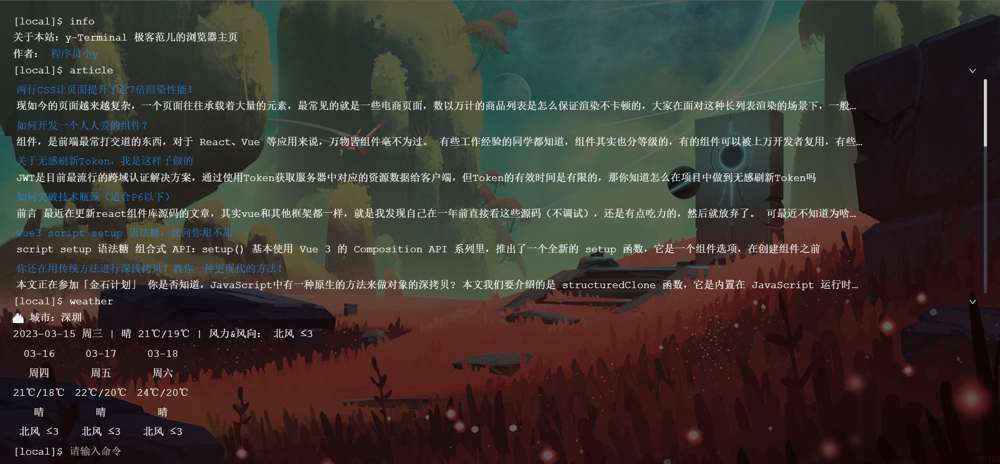
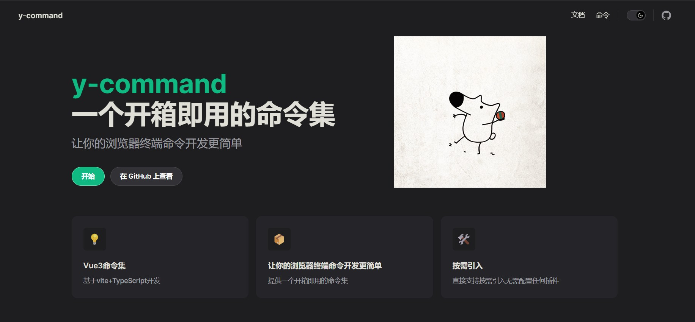
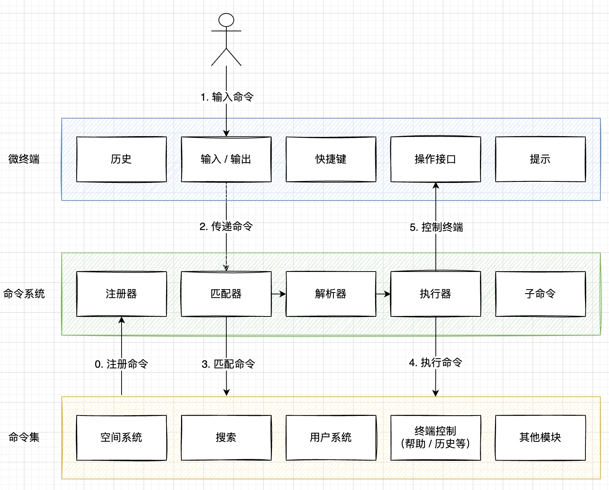

# y-terminal - 极客范儿的浏览器主页

> Coolest browser index for geeks! 
> 
> 前后端全栈项目 By [程序员小y](https://panjingyi.top/)


在线体验：[y-terminal](https://terminal.panjingyi.top/#/)





## y-terminal 是什么？

一个很特别的浏览器主页，支持使用输入命令的方式来操作，目标是帮你在一个 web 终端中高效完成所有的事情！（all in one）

此外，它也是一个功能强大的 web 终端组件。开发者可以在它的基础上定制自己的 web 终端，并且可以在终端中集成任何内容！

> 如果你是一名程序员，相信你会爱上它~


你可以将音乐、游戏，甚至可以将自己的偶像封装到主页~


### 1 分钟上手使用

请打开网站：[y-terminal](https://terminal.panjingyi.top/#/)

然后在网站内输入命令：

```bash
help 回车，显示所有支持的命令
```

使用  `help 命令英文名` 可以查询某命令的具体用法，如：`help search` 。

使用 `shortcut` 可以查看所有的快捷键。


尽情探索吧~

## 🚀附属命令集

> **让你的终端浏览器命令开发更简单**

目前该项目集成的命令有限，为了使项目代码结构清晰，方便用户二次开发，自己实现了 y-terminal 浏览器支持的命令集，开箱即用，用户可根据喜好选择按需引入，更好地支持实现浏览器定制化。
👉 **[y-command](https://github.com/mengqiuleo/y-command)**

  

  

<br/>
<br/>

**在线文档**: https://y-command-doc.vercel.app

**npm包地址**: https://www.npmjs.com/package/y-command



## 项目优势

### 用户

- 无需鼠标，即可快速完成操作（比如从不同平台搜索内容）
- 极简炫酷，极客范儿，Linux 的味道儿~
- 支持快捷键、帮助和输入提示，降低使用成本
- 支持定制背景等，打造你的个性主页
- 帮助你熟悉 Linux 命令，感受到编程的乐趣


### 开发者

- 可以独立使用功能丰富的 web 终端组件，或二次开发
- 可以开发自己的命令并接入系统


### 学习者

- 可以学到 web 终端的开发方式
- 可以学到系统设计知识，理解抽象和复用
- 可以学到较为规范的代码目录和格式


## 功能和特性

### web 终端

- 命令历史记录、快速执行历史命令
- 快捷键
- 清屏
- 命令输入提示
- Tab 键补全命令
- 内置 5 种输出状态
- 命令折叠 / 展开
- 帮助手册自动生成
- 自定义配置（比如更换背景、提示开关等）


### 已支持命令


- 多平台搜索 search
- 网页快速跳转 goto
- 查看日期 date
- 网络检测 ping
- 下班倒计时 time
- 沉浸模式 focus
- 天气查询 weather
- 更换背景 background
- 掘金文章推荐 article
- 听音乐 music
- 摸鱼小游戏 moyu
- 音乐热榜 hot
- 其它...


## 技术栈

### 前端

主要技术：

- Vue 3
- Vite 2
- Ant Design Vue 3 组件库
- Pinia 2 状态管理
- TypeScript 类型控制
- Eslint 代码规范控制
- Prettier 美化代码

依赖库：

- axios 网络请求
- dayjs 时间处理
- lodash 工具库
- getopts 命令参数解析

库：getopts


### 后端

主要技术：

- Node.js
- Express、express-session


依赖库：

- Axios
- NeteaseCloudMusicApi

依赖服务：

- 百度翻译 API
- 新浪壁纸 API


## 目录结构

- public 公共静态资源
- server 后端
- src
  - assets 静态资源
  - components 组件
    - y-terminal 终端组件
  - configs 配置
    - routes 路由
  - core 核心
    - commands 命令集
    - commandRegister 命令注册
    - commandExecutor 命令执行器
  - pages 页面
    - IndexPage.vue 主页
  - plugins 第三方依赖
  - utils 工具
  - App.vue 主页面
  - env.d.ts 环境定义
  - main.ts Vue 主文件
- .eslintrc.js 代码规范
- components.d.ts 自动生成的组件动态引入
- Dockerfile 镜像构建
- index.html 静态主页
- package.json 项目管理
- tsconfig.json TS 配置
- vite.config.ts 打包工具配置


## 系统设计

### 设计理念

1. 开放：采用类插件化设计，便于开发者自定义新命令，且能够通过配置自动生成帮助提示
2. 重前端轻后端：考虑到扩展性、安全性以及实现的方便，除了核心模块外，尽量不请求后端


### 核心

系统分为 3 个核心模块，各模块职责分明：

- 微终端：UI 展示和终端交互逻辑
- 命令系统：连接微终端和命令集（中介者），负责匹配、解析和执行命令，并通过终端提供的操作接口给予其反馈
- 命令集：各种不同功能的命令定义和实现


前端架构图：




### 微终端

从 0 开始实现的 web 终端控制台，包含以下模块：

- 终端输入：常驻 Input 框，负责接收用户命令
- 终端输出：负责展示用户的命令及执行结果等，支持以下三种类型的输出
  - 命令类型：输入命令 + 结果列表
  - 文本类型：单行文本展示，内置 5 种不同的展示状态（成功、错误、警告、信息、系统等）
  - 自定义组件类型：可以自由定制要展示的内容
- 快捷键：更方便地操作终端，使用 `document.onkeydown` 全局按键事件实现
- 开放接口：提供一组操作终端的 API，供命令系统调用，比如清屏、立即输出等
- 命令历史：记录用户输入的命令结果，使用 Vue 3 Composition API 封装部分逻辑
- 命令提示：根据用户的输入给出提示，使用 Vue 3 Composition API 独立封装


### 命令系统

一套独立于终端的命令解析执行引擎，包含以下模块：

- 注册器：用于注册和管理可被匹配的命令集
- 匹配器：根据输入文本匹配到对应的命令
- 解析器：从输入文本中解析出参数和选项
- 执行器：执行命令，完成操作


### 命令集

一组可用命令的集合（类似插件），通过 TS 明确命令的定义，支持配置别名、选项、子命令等，便于开发者扩展和定制。

核心命令包括：

- 终端控制：定制或控制终端，比如更换背景、输出帮助等
- 搜索：可以快速从不同搜索引擎检索内容
- 用户自定义命令...


### 为什么要自己写终端？

1. 本来打算使用现成的 xterm.js，但实际使用中发现它的文档比较少、问题难解决（比如中文字符），解决问题消耗的时间足够自己写一套新的 web 终端了。而且它更适用于和后端服务器强交互的场景，与本项目的定位不符。
2. 开源的 web 终端很少，给开源贡献一份力。
3. 帮助自己复习 Vue，突破个人系统开发设计能力的边界。


### 开发新命令

1. 在 commands 下新建目录，目录名称为命令英文名称，所有该命令相关的代码都必须放在该目录中
2. 编写命令定义文件 xxxCommand.ts（xxx 为命令英文名称），可以参考其他命令，如 music、goto 等
3. 在 commandRegister 的 commandList 中补充新命令


## 致谢

摸鱼命令的实现依赖于 https://haiyong.site/moyu ，感谢大佬的开源分享。
